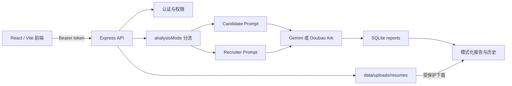

# Eval Bar AI 架构说明

## 1. 系统目标

Eval Bar AI 在同一套认证、AI Provider 和报告存储之上提供两种互不混排的分析模式：

- `candidate`（提升自己）：基于面试记录生成候选人复盘建议，不输出招聘评分。
- `recruiter`（判断他人）：基于岗位胜任力和面试记录生成人岗匹配评估。

模式只决定输入、Prompt、报告结构和展示方式，不绑定账号。一个账号可以随时切换模式。

## 2. 运行结构



前端开发环境由 `scripts/dev.mjs` 同时启动 Vite 和 Express；生产环境由 Express 在 3000 端口同时托管 `dist/` 与 `/api/*`。

## 3. 前端路由

| 路由 | 权限 | 行为 |
|---|---|---|
| `/` | 公开 | 双模式产品首页 |
| `/login` | 公开 | 登录/注册；成功后恢复目标模式 |
| `/app/candidate` | 登录 | 候选人三步复盘流程 |
| `/app/recruiter` | 登录 | 招聘方分析流程 |
| `/history/candidate` | 登录 | 仅显示 Candidate 报告 |
| `/history/recruiter` | 登录 | 仅显示 Recruiter 报告 |
| `/app`、`/history` | 登录 | 根据上次使用的模式跳转，缺省为 Recruiter |
| `/report/:id` | 登录 | 根据报告自身 `analysisMode` 渲染 |
| `/admin` | 管理员 | 报告、反馈与两套 Prompt 管理 |

`services/analysisMode.ts` 负责模式校验、兼容路由、上次使用模式和登录后目标路径。非法模式不会进入业务组件。

## 4. 分析数据流

### 4.1 Candidate

1. 用户填写职位名称，选填 JD 和简历。
2. 浏览器解析 PDF、DOCX 或 TXT，并用 `services/parseQuality.ts` 判断 `usable`、`low_quality`、`empty` 或 `manual`。
3. 面试记录通过文件解析或文本粘贴进入确认页。
4. 有简历源文件时前端发送 `multipart/form-data`；没有文件时发送 JSON。
5. `server.js` 校验模式、必填字段、文件大小、MIME、扩展名和文件签名。
6. `services/analysisRequest.js` 把用户材料序列化到 `<input_json>` 数据边界；低质量或空白简历正文不进入模型输入。
7. `services/candidatePrompt.js` 要求模型按“真实追问 > JD > 岗位常见要求”筛选问题，并以面试记录优先于简历。
8. AI 成功后，服务端保存源文件，并在同一 SQLite transaction 中创建报告和附件记录。
9. Candidate 报告不解析 NH/H-/H/H+/MH，不展示胜任力评分。

### 4.2 Recruiter

Recruiter 继续使用职位名称、胜任力要求和面试记录。旧客户端未传 `analysisMode` 时默认 `recruiter`，以保持兼容。Recruiter Prompt、评分解析、历史统计和反馈选项保持独立。

## 5. 后端模块

| 模块 | 职责 |
|---|---|
| `server.js` | Express 路由、认证守卫、AI Provider 调用和静态托管 |
| `services/schema.js` | 幂等建表与 reports 列迁移 |
| `services/db.js` | 打开 `data/app.db`、启用 WAL、初始化 schema |
| `services/analysisRequest.js` | 模式校验与安全模型输入构造 |
| `services/candidatePrompt.js` | 默认 Candidate System Prompt |
| `services/promptService.js` | 两套 Prompt 的初始化、读取和版本更新 |
| `services/reportService.js` | 报告查询、模式过滤、事务写入和权限校验 |
| `services/reportAttachmentService.js` | 简历校验、随机路径保存、解析状态和文件清理 |
| `services/userService.js` | 用户、token 与管理员身份 |

## 6. 数据模型

### `reports`

核心字段包括：

- `analysis_mode TEXT NOT NULL DEFAULT 'recruiter'`
- `job_title`、`job_description`、`competencies`
- `file_name`、`transcript`、`resume_text`
- `result`、`created_at`、`user_id`

旧报告通过默认值继续归入 Recruiter。

### `report_attachments`

保存附件元数据：`report_id`、`user_id`、原文件名、随机存储名、相对路径、MIME、大小、SHA256、解析状态和时间。数据库不保存机器绝对路径。

### Prompt 表

- `system_prompt`：Recruiter Prompt 版本历史。
- `candidate_system_prompt`：Candidate Prompt 版本历史。

Candidate 首版不调用 Recruiter 的反馈自动迭代接口。

### 其他表

- `users`、`tokens`：认证数据。
- `feedback`：报告反馈；不复制简历正文。

## 7. 文件存储与权限

简历源文件位于：

```text
data/uploads/resumes/<user-id>/<random-id>.<ext>
```

安全边界：

- 只允许 PDF、DOCX、TXT，最大 10 MB。
- 服务端同时验证扩展名、MIME 和签名。
- 原文件名只作为下载元数据，不参与存储路径。
- `data/` 不由 Express 静态托管。
- 下载只能经过 `GET /api/reports/:id/resume`，并校验报告所有者或管理员。
- 删除报告时先取得附件信息，再删除数据库记录和源文件。

首版没有 OCR 或病毒扫描。扫描版 PDF 可以保存源文件，但需要用户人工补充可用文本。

## 8. Prompt 与材料边界

用户提供的 JD、简历和面试记录全部视为不可信数据，不允许覆盖 System Prompt。`analysisRequest.js` 使用 JSON 序列化并转义标签字符，避免材料通过字符串拼接伪装成指令。

Candidate Prompt 的稳定边界：

- 不预测录用，不给招聘等级或百分制评分。
- 默认输出 3 个核心问题，最多 5 个；证据不足时允许更少。
- 示例回答只能重组材料中的真实信息，缺失事实使用占位符。
- 仅来自简历的信息必须提示候选人确认。
- 报告目标长度 1500–2200 个中文字符。

## 9. 兼容与失败处理

- 未传 `analysisMode` 的分析请求按 Recruiter 处理。
- 报告列表未传模式时返回当前用户全部报告，供旧客户端兼容。
- AI 失败时不创建报告、不保存源文件。
- 文件已保存但事务失败时，服务端清理本次孤立文件。
- 简历磁盘文件缺失不影响报告查看，下载接口返回 `404`。
- 报告 Markdown 结构不完整时使用通用 Markdown 渲染。

## 10. 验证入口

自动化测试位于 `tests/`，覆盖模式、输入边界、解析质量、schema、Prompt、报告事务和附件安全。常规验证：

```bash
npm test
npm run build
```

生产冒烟见 [operator-runbook.md](operator-runbook.md)，接口示例见 [integration-guide.md](integration-guide.md)。
